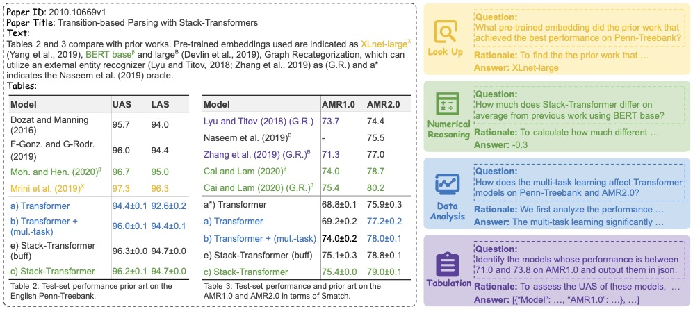

# SciTaT: A Question Answering Benchmark for Scientific Tables and Text Covering Diverse Reasoning Types

## Introduction
This repository contains the code and data for the paper SCITAT: A Question Answering Benchmark for Scientific Tables and Text Covering Diverse Reasoning Types



## Dataset

SciTaT contains 13,808 questions associated with 8,907 arxiv papers.

You can download our SciTQA dataset via [SciTaT](./dataset).

Each question in our SciTaT dataset contains the following keys:
```python
{
        "id": The unique id of the question,
        "paragraph": {               
            # The paper paragraph related to the question
            "paragraph_id": The unique id of the paragraph,
            "text": The content of the paragraph
        },
        "tables": [                                                                                              
            # The tables related to the question
            {
                "table_id": The unique id of the table,
                "label": The label of the table used in the latex code of the paper,
                "caption": The caption of the table,
                "table": List[List[str]], the content of the table,
                "latex": str, the LaTeX format of the table
            }
        ],
        "question": The question itself,
        "question_c": The Chinese question,
        "question_type": The question type,
        "reasoning": The reasoning rationale of the question,
        "reasoning_c": The Chinese reasoning rationale of the question,
        "answer": The answer of the question,
        "answer_c": The Chinese answer of the question
    }

```

## Baselines

You can run [slurm/run_baselines.slurm](slurm/run_baselines.slurm) to conduct the baselines.

You can run [slurm/run_car.slurm](slurm/run_car.slurm) to perform our proposed baseline CaR.

You can run [slurm/run_evaluation.slurm](slurm/run_evaluation.slurm) to evaluate your predicted result.

